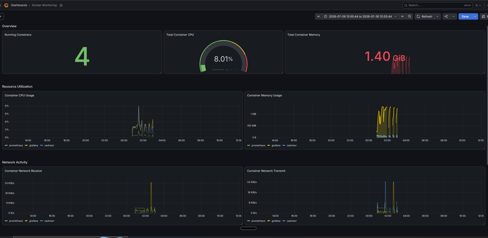
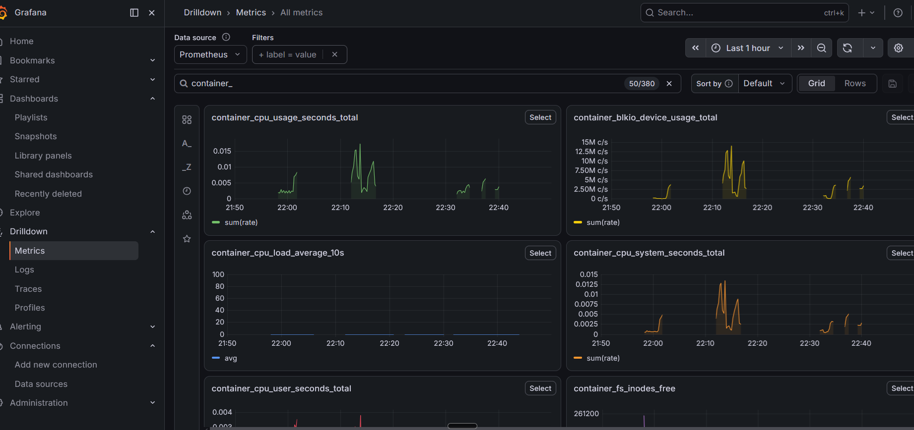

# Docker Container Monitoring Stack

A hands-on DevOps project demonstrating container monitoring using Prometheus, Grafana, and cAdvisor on AWS EC2.

---

## Architecture


---

## Technologies Used

- AWS EC2
- Docker
- Prometheus
- Grafana
- cAdvisor
- Bash
- PromQL

---

## Project Overview

This project demonstrates how to build a container monitoring stack for Dockerized workloads.

The monitoring stack was automated using a Bash script and deployed on an AWS EC2 instance. Prometheus scrapes metrics from cAdvisor, while Grafana visualizes container resource utilization through interactive dashboards.

---

## Features

- Automated deployment using Bash
- Dockerized monitoring stack
- Custom Prometheus configuration
- Grafana with pre-configured Prometheus datasource
- Container CPU monitoring
- Memory monitoring
- Network traffic monitoring
- Running container overview
- Container uptime visualization

---

## Project Scope

This project focuses on infrastructure and container-level monitoring using cAdvisor. Application-level metrics were intentionally left out and can be added by instrumenting the application with Prometheus client libraries.

## Project Structure

```
scripts/
setup-monitoring.sh

architecture/
monitoring-architecture.png

screenshots/
```

---

## Dashboard

### Grafana Dashboard



---

## Prometheus Targets


---

## Prometheus Query



---

## Learning Outcomes

- Docker container monitoring
- Prometheus configuration
- PromQL querying
- Grafana dashboard creation
- Bash automation
- Container observability fundamentals

